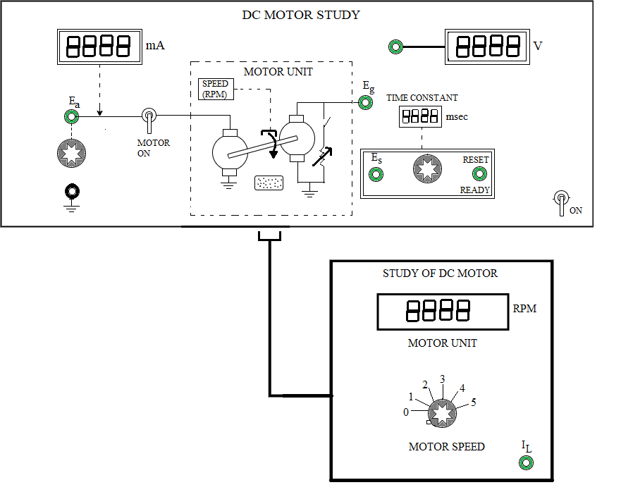

## Introduction

<b>Discipline | <b> Electrical Engineering 
:--|:--|
<b> Lab | <b> **Control and Instrumentation Lab**
<b> Experiment|     <b> **Study of DC Motor**

### About the Experiment 
**System description**

DC motors are most commonly used as actuators in electro-mechanical control systems or servo mechanisms. Compared to actuators like 2-phase ac motor and stepper motor, the dc motor has the advantage of higher torque and simpler driving circuit. However the presence of a commutator and a set of brushes with the problems of 
sparking make the dc motor less durable. 
					
The study of the dynamic characteristics of the dc motor is important because the overall performance of the control system depends on it.

This experiment is designed to obtain the torque-speed characteristics, compute the various parameters and finally determine the transfer function of a dc motor.			  
			  

<b>Fig. 1. Panel drawing of DC Motor</b>

<b>Subject matter expertise | <b> **Prof. Alok Kanti Deb**
:--|:--|
<b> Institute | <b>  **Indian Institute of Technology Kharagpur**
<b> Email id|     <b>  **alokkanti@ee.iitkgp.ac.in**
<b> Department |  **Department of Electrical Engineering**
<b>Webpage| <b> http://www.iitkgp.ac.in/department/EE/faculty/ee-alokkanti

### Contributors List

SrNo | Name | VLabs Developer or Integration Engineer | Designation | Department| Institute
:--|:--|:--|:--|:--|:--|
1 | **Piyali Chattopadhyay** | Developer | Project Scientist | Department of Electrical Engineering | IIT Kharagpur | 
2 | **Subhasis Mahata** | Integration Engineer | Senior Project Scientist | Department of Mechanical Engineering | IIT Kharagpur |