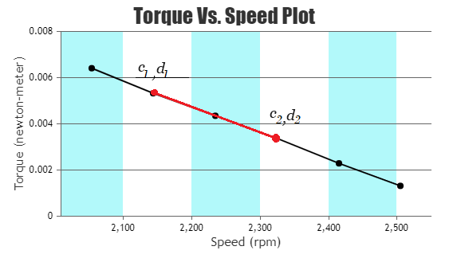

# Theory

The first step in the analysis of control system is to derive its mathematical model to understand the working of the complete system.
               			   
<b>The Plant (Coupled-DC Motor-Generator Set)</b> 

In a dc motor, an armature rotates inside a magnetic field. The basic working principle of a dc motor is based on the fact that when ever
a current carrying conductor is placed inside a magnetic field, there will be a mechanical force experienced by that conductor.
All kinds of dc motors work under this principle. Hence for constructing a dc motor, it is essential to establish a magnetic field.
The magnetic field is established by using a magnet. Different types of magnets can be used – it may be an electromagnet or 
it can be a permanent magnet.
 
A permanent magnet dc motor is a type of dc motor that uses a permanent magnet to create the magnetic field required for
the operation of a dc motor.	
 

				
 
<b>Fig. 1. Permanent Magnet DC Motor</b>

 

 <b>Mechanical Section</b> 
It comprises of the experimental permanent magnet dc motor
(&asymp; 8 W) coupled to a small dc generator (&asymp; 2 W), which serves the twin
purposes of, 

1. Electrical loading of the motor 
2. Transient response signal pick-up. 

Further, a slotted disk mounted on the common shaft produces 6 pulses per revolution
through an opto - interrupter, which is used in a 4-digit speed display in r.p.m. 

The specifications of the main experimental dc motor are: 

• Operating voltage :12 V dc 
• No load current: 0.09 A 
• Full load current: 1.0 A 
• Torque: 30 mN-m / 300 g-cm 

 <b>Permanent Magnet DC Motor (PMDC Motor)</b> 

The field poles of this motor are essentially made of permanent magnet. This motor mainly consists of two parts.
A stator and an armature. Here the stator is a steel cylinder. The magnets are mounted in the inner periphery of this cylinder.
The permanent magnets are mounted in such a way that the N-pole and S-pole of each magnet are alternatively faced towards the armature
as shown in the Fig. 2.

				
 
<b>Fig. 2. Cross section of PMDC Motor</b>

 				

 <b>Working Principle</b> 

The working principle of permanent magnet dc motor is just similar to the general working principle of a dc motor.
When a current carrying conductor comes inside a magnetic field, a mechanical force will be experienced by the conductor and
the direction of this force is governed by Fleming’s left hand rule.
As in a permanent magnet dc motor, the armature is placed inside the magnetic field of a permanent magnet,
the armature rotates in the direction of the generated force. Here each conductor of the armature experiences
the mechanical force F = B.I.L Newton where, B is the magnetic field strength in Tesla (weber / m2),
I is the current (ampere) flowing through that conductor and L is the length of the conductor (meter) comes under the magnetic field.
Each conductor of the armature experiences a force and the compilation of those forces produces a torque, which tends to rotate the armature.

				
 
<b>Fig. 3. Schematic diagram of DC Motor</b>

 

<b>DC Motor model </b> 

The schematic diagram of a dc motor is shown in Fig. 3 where the following notations are used 
ea : Armature voltage (volts) 
ia : Armature current (amp.) 
Ra : Armature resistance (ohms) 
La : Armature inductance (henrys) 
eb : Back emf (volts) 
if : Field current (amp.) 
TM : Motor torque (newton-m) 
TL : Load torque (newton-m) 
&omega; : Angular velocity (rad/sec) 
J : Moment of inertia of the rotor including external loading if any (newton-m/rad/sec2) 
B : Viscous friction coefficient including external loading if any (newton-m/rad/sec) 
KT : Torque constant 
Kb : Back emf constant 

  Upper case notations Ea, 
Ia, Eb, 
If 

are used for steady state values of the respective
variables ea, ia ,
eb and if 				
 

In the present setup a permanent magnet dc motor is used, the field winding is thus absent and the air gap flux is constant. 
The input drive may therefore be applied to the armature only, i.e. only armature controlled operation is possible.
The mathematical equations in this operating mode are, 

$$T_M = K_T \ i_a \tag{1}$$

$$e_b = K_b \ \omega \tag{2}$$

Armature circuit model

$$L_a\frac{di_a}{dt} + R_a i_a + e_b = e_a \tag{3}$$

Mechanical model

$$J\frac{d\omega}{dt} + B\omega + T_L = T_M \tag{4}$$

Taking Laplace Transform of (3) and (4),

$$\frac{\omega(s)}{E_a(s)} = \frac{K_T}{(sL_a + R_a)(sJ + B) + K_T K_b} \tag{5}$$

Assuming the inductance of the armature circuit to be very small, the motor transfer function may be written as, 

$$G_M(s) = \frac{\omega(s)}{E_a(s)} = \frac{K_T/R_a}{Js + B + \frac{K_T K_b}{R_a}} = \frac{K_M}{s\tau_m + 1}    \tag{6}$$

Motor Gain Constant (KM)

$$K_M = \frac{K_T}{R_a B + K_T K_b} \tag{7}$$

Motor Time Constant (&tau;m)

$$\tau_m = \frac{R_a J}{R_a B + K_T K_b} \tag{8}$$

The armature controlled motor therefore has a first order type-0 transfer function and the two constant KM and 
&tau;m

depend upon motor parameters.  

<b> Torque – Speed Curves</b> 

As a mechanical actuator the magnitude of the steady state torque produced by the motor with a given armature voltage 
needs to be known. With a simple rearrangement of terms, the motor torque may be written as, 

steady state armature current, 

$$I_a = \frac{E_a-E_b}{R_a} = \frac{E_a}{R_a} - \frac{K_b \omega}{R_a} \tag{9}$$

steady state torque generated, 

$$T_M = K_T I_a = \frac{-K_T K_b}{R_a}\omega + \frac{K_T}{R_a}E_a \tag{10}$$

Here TM, Ea, Eb, Ia and &omega; are the steady state values of the motor torque, applied
armature voltage, back emf, armature current and angular velocity of the shaft. 

A typical plot of the equation (10) is shown in Fig. 4. This assumes a linear torque-speed behaviour.  

				
 
<b> Fig. 4. Torque - Speed Characteristics</b>

 

As the motor runs at a constant speed, 
Electrical power input, Pin = Ea &times; Ia Watts  
Power lost in Ra = Ra &times; Ia &times; Ia 
Power available in the armature, Parm = (Ea – Ia Ra)
Ia = Eb &times; Ia
= Kb &times; &omega; &times; Ia 

Mechanical power developed,

$$P_{mech} = T_M \times \omega \ \ newton-m \ rad/sec \ = K_T \times I_a \times \omega \tag{11}$$

Assuming 100% conversion of power from electrical input to mechanical output, the above two expressions of <i style="font-family:'Sitka Text'">Pmech</i> and <i style="font-family:'Sitka Text'">Parm</i>
can be equated to get

$$K_b \ ( \frac{volts}{rad/s} ) = K_T \ ( \frac{newton-m}{amp.} ) \tag{12}$$

Thus, the numerical values of KT and Kb may be assumed to be identical. The torque may then be expressed as,

$$T_M = \frac{-K_b^2}{R_a}\omega + \frac{K_b}{R_a}E_a \tag{13}$$

When the motor is loaded, the speed decreases which reduces the back emf. This
increases armature current ia so that the motor develops more torque in order to supply the load.

At steady state (&omega; = constant) the load torque equation can be written as, 

$$T_M = B \omega + T_L \tag{14}$$ 

where, TL  = Load Torque  

In the experimental work TL is increased in steps by loading the motor with the help of the coupled generator and the values
of TM and &omega; are recorded. While &omega; is computed from the speed N 
in rpm, as displayed on the motor unit,

the following expression is used to compute	the motor torque TM at a constant value of Ea.

$$T_M = K_T I_a = K_b I_a = \frac{E_b}{\omega} I_a = \frac{E_a - I_a R_a}{\omega} I_a \tag{15}$$

Two motor parameters, B and Kb, may therefore be determined from the torque-speed
characteristics obtained under steady state conditions or constant speed operation of the motor.   

<b>Transient Response </b> 

In response to a step input,

$$e_a(t) = E \ U(t), \ i.e. \ E_a(s) = \frac{1}{s} \tag{16}E$$

The motor speed will follow the expression,

$$\omega(t)= E \ K_M (1- e^\frac{-t}{\tau_m}) \tag{17}$$

as shown in Fig. 5  

The step response is very similar to that of an RC circuit charging from a step voltage input.
The parameters of interest E KM and &tau;m are indicated in Fig. 5. 

The steady state speed N, and hence the value of KM can easily be computed or measured.

$$\omega(t)\vert_{t\rightarrow\infty} = \omega_{ss} = E \ K_M \tag{18}$$

$$or, \ K_M = \frac{N}{E} \frac{rpm}{volt} = \frac{\pi N}{30 E} \ \frac{rad/s}{volt} \tag{19}$$

&tau;m is the time taken by the motor speed to rise from zero and attain 63.2% of 
<i style="font-family:'Sitka Text'">&omega;ss</suab></i>, where <i style="font-family:'Sitka Text'">&omega;ss</suab></i> is the steady state speed (rad/s) of the motor.

				
 
<b>Fig. 5. Step response of the motor</b>

  

<b>Calculations from plots</b> 

<b>Calculation of the motor constant KM (rpm/volts), generator constant KG (volts/rpm) and viscous friction coefficient of motor (B)</b> 

The motor constant KM is calculated from the plot 'Speed (N) Vs. Motor armature voltage (Ea)' as
shown in Fig. 6. Consider a slope is taken between points (c2, d2) and (c1, d1) first. then the KM will be

$$K_M = \frac{d_{2} - d_{1}}{c_{2} - c_{1}} \ rpm/volts \tag{20}$$

Where, d2 is speed (rpm) of the motor at armature voltage of c2 volts and 
d1 is speed (rpm) of the motor at armature voltage of c1 volts.
 

				
 
<b>Fig. 6. Motor constant KM calculation</b>

  

The generator constant KG is calculated from the plot 
'Generator voltage (Eg) Vs. Speed (N)' as
shown in Fig. 7. Consider a slope is taken between points (c2, d2) and (c1, d1) first. Then the KG will be

$$K_G = \frac{d_{2} - d_{1}}{c_{2} - c_{1}} \ volts/rpm \tag{21}$$

Where, d2 is generator voltage (volts) at speed of c2 rpm and 
d1 is generator voltage (volts) at speed of c1 rpm.
 

				
 
<b>Fig. 7. Generator constant KG calculation</b>

  

The viscous friction coefficient of motor (B) is calculated from the plot 
'Torque (TM) Vs. Speed (N)' as
shown in Fig. 8. Consider a slope is taken between points (c2, d2) and (c1, d1) first. Then the B will be

$$B = \frac{d_{2} - d_{1}}{c_{2} - c_{1}} \ newton-meter/rpm \tag{22}$$

Where, d2 is torque (newton-meter) at speed of c2 rpm and 
d1 is torque (newton-meter) at speed of c1 rpm.
Calculate B in newton-meter/rad/sec. The negative sign in calculation will depict negative slope (ignore it for calculating the motor inertia J).
 

				
 
<b>Fig. 8. Viscous friction coefficient of motor (B) calculation</b>

  

The motor inertia J (newton-meter/rad/sec2) is calculated using the formula below (&tau;m is taken in sec)

$$J = \tau_m (B + \frac{K_b^2}{R_a}) \tag{23}$$

where, &tau;m is the motor time constant and Ra = 4 &ohm;
				

				
<link href="./simulation/css/DC.css" rel="stylesheet">			    
						
								
